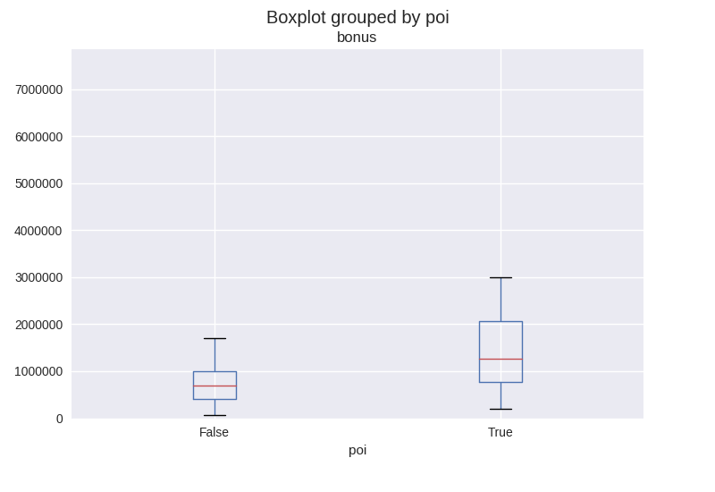
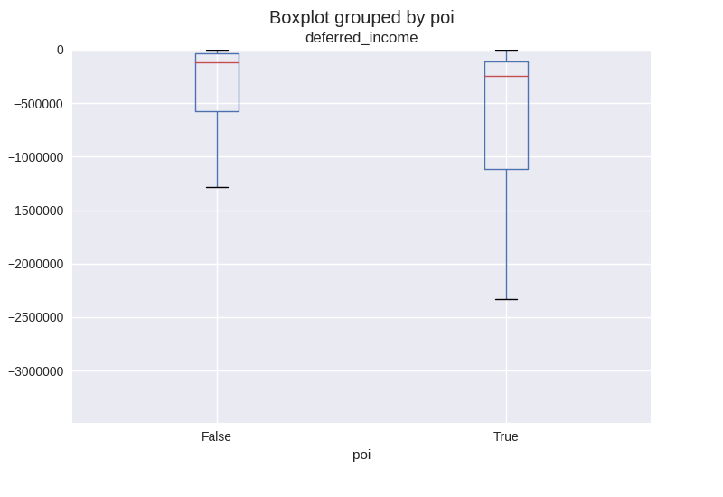
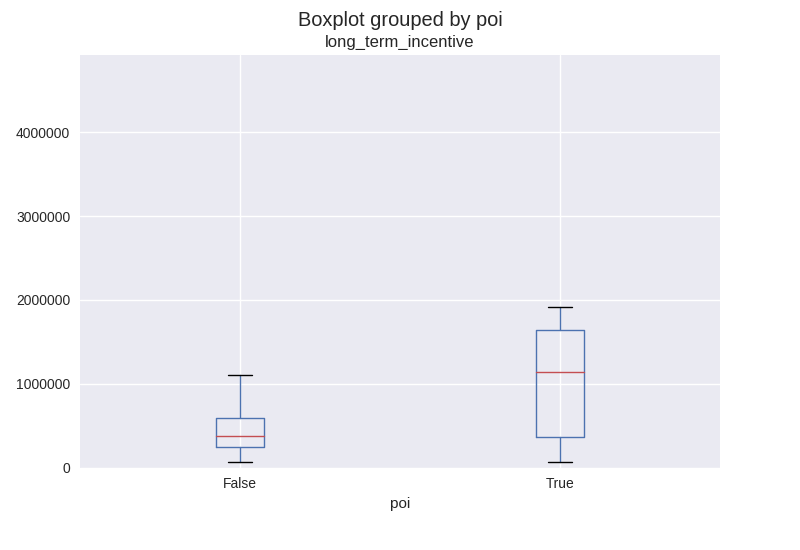
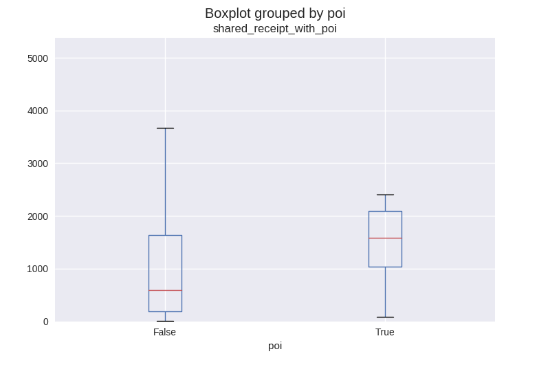

#Questions

## Goal and Machine Learning deployment 
In 2000, Enron was one of the largest companies in the United States. 
By 2002, it had collapsed into bankruptcy due to widespread corporate fraud. 
In the resulting Federal investigation, a significant amount of typically 
confidential information entered into the public record, including tens of 
thousands of emails and detailed financial data for top executives. 
In this project, I will build a person-of-interest (PoI) identifier based on 
financial and email data made public as a result of the Enron scandal. 
As input data, a hand-generated list of PoIs in the fraud case is available, 
which means individuals who were indicted, reached a settlement 
or plea deal with the government, or testified in exchange for prosecution 
immunity. The identifier will be a machine learning mode, that can identify with 
some validity a possible PoI based on his compensation (e.g. stock value,  
salary etc.) and on his communication behaviour (e.g. emails sent to other PoIs, 
total number of sent emails etc.).   

### Data Exploration
As a basis for any further investigation, I transferred the pickled data set 
into a Pandas data frame for easier handling ([approach][1])
 
There are 146 data points in the final project dataset. 18 records contain the 
PoI flag, i.e. 128 do not (poi has no NaN values). 
Each record in the data set has 21 attributes. Most features have a fair 
amount of NaN values; especially problematic are the 
following features:
* deferral\_payments: 107
* restricted\_stock\_deferred: 128
* director\_fees: 129
* loan\_advances: 142

Those features will be removed from further analysis. Also, email\_address is 
removed. All NaN values are replace with 0. In summary, 15 input features and 
the PoI label remain.  

As part of my small exploratory data analysis, I created a number of box plots, 
in which the non-PoI and the PoI-associated distribution of a feature can be 
compared ([based on this approach][2]). 
Most of these box plots were not particularly insightful, there was 
no discernible difference between the two distributions which means that the 
features are not particularly helpful in telling apart PoIs and non-PoIs.    
However, the following plots were interesting: 
     

PoIs tend to have higher bonus payments than non-PoIs. The average bonus payment 
overall is $1,333,474, the median  bonus payment overall is $300,000.

PoIs tend to have a larger share of deferred income than non-PoIs. This could 
indicate that PoIs have higher stakes in the game and are willing to bet on the 
company. The mean overall deferred income is $-382,762, the overall median 
deferred income is $0.
 

PoIs tend to have massively larger long term incentive payments than non-PoIs. 
Typically, long-term incentives are given to executives to guide the strategic 
development of the enterprise. 
The mean overall long-term incentive is $664,683, the overall median 
long-term incentive is $0.
  

PoIs tend to receive more emails that were also sent to other PoIs; you could 
argue that PoIs had a tighter communication network to other PoIs than to 
non-PoIs , which would be normal for partners in crime.  
The mean overall value for shared\_receipt\_with_poi is ca. 692, the overall 
median value for shared\_receipt\_with_poi is ca. 102.

### Data dictionary
There are 20 independent variables, and one dependent variable, poi. Here is a 
description of the features:
* compensation-related
    * salary:  Reflects items such as base salary, executive cash 
    allowances, and benefits payments.
    * deferral\_payments: Reflects distributions from a deferred compensation 
arrangement due to termination of employment or due to in-service withdrawals 
as per plan provisions.
    * total\_payments: Sum of salary, bonus, long term incentive, deferred income,
 deferral payments, loan advances, other, expenses, director fees. All numbers 
 are in US Dollars. 
    * loan\_advances: Reflects total amount of loan advances, excluding repayments, 
provided by the Debtor in return for a promise of repayment. In certain 
instances, the terms of the promissory notes allow for the option to repay with 
stock of the company.
    * bonus: Reflects annual cash incentives paid based upon company performance. 
Also may include other retention payments.
    * long\_term\_incentive:  Reflects long-term incentive cash payments from 
various long-term incentive programs designed to tie executive compensation to 
long-term success as measured against key performance drivers and business 
objectives over a multi-year period, generally 3 to 5 years.
    * other: Reflects items such as payments for severance, consulting services, 
    relocation costs, tax advances and allowances for employees on international 
    assignment (i.e. housing allowances, cost of living allowances, payments 
    under Enron’s Tax Equalization Program, etc.). May also include payments 
    provided with respect to employment agreements, as well as imputed income 
    amounts for such things as use of corporate aircraft.    
    * deferred\_income:  Reflects voluntary executive deferrals of salary, 
    annual cash incentives, and long-term cash incentives as well as cash fees 
    deferred by non-employee directors under a deferred compensation arrangement. 
    May also reflect deferrals under a stock option or phantom stock unit in 
    lieu of cash arrangement.    
    * expenses:  Reflects reimbursements of business expenses. May include fees 
    paid for consulting services.    
    * director\_fees:  Reflects cash payments and/or value of stock grants made 
    in lieu of cash payments to non-employee directors.    
* stock_related
    * restricted\_stock\_deferred:  Reflects value of restricted stock voluntarily 
deferred prior to release under a deferred compensation arrangement. 
    * total\_stock\_value: sum of exercised\_stock\_options, 
restricted\_stock\_deferred and restricted\_stock in US Dollars.    
    * exercised\_stock\_options:  Reflects amounts from exercised stock options 
    which equal the market value in excess of the exercise price on the date 
    the options were exercised either through cashless (same-day sale), stock 
    swap or cash exercises. The reflected gain may differ from that realized 
    by the insider due to fluctuations in the market price and the timing of 
    any subsequent sale of the securities.    
    * restricted\_stock:  Reflects the gross fair market value of shares and 
    accrued dividends (and/or phantom units and dividend equivalents) on the 
    date of release due to lapse of vesting periods, regardless of whether 
    deferred.    
* email-related:
    * to\_messages: number of email messages to this person
    * email\_address
    * shared\_receipt\_with\_poi: number of email messages that the person received 
along with some PoI.
    * from\_messages: number of email messages from this person
    * from\_poi\_to\_this\_person: number of email messages from a poi to this 
    person
    * from\_this\_person\_to\_poi: number of email messages from this person to 
    a poi
* poi: PoI label, 0 for no PoI, 1 for PoI

    
### Outlier Investigation
As discussed in the quizzes, the data record 'TOTAL' is an outlier and will be 
removed from the data set. The key 'THE TRAVEL AGENCY IN THE PARK' is also an 
outlier, as it does not sound like a real person who could be a PoI. Other 
extreme values were not removed, as they seemed to reasonable in the context of 
the data set and thus provide valuable information.

## Features
### New Feature development
I developed three new features based on the results of the exploratory data 
analysis. There, bonus, long\_term\_incentive and shared\_receipt\_with\_poi 
proved to be features with a high explanatory value. 
The reasoning was that I could improve an already informative feature by 
relating it to a logical base value:   
- **bonus_to_salary_ratio**: This feature is the ratio of the bonus to the salary 
of a person. The higher your share of your variable compensation, the 
more likely you are a PoI. 
- **lti_ratio**: This feature is the ratio of the long\_term\_incentive to the 
total\_payments. The more you are invested in the enterprise, the higher the 
more likely you are a PoI.
- **shared_ratio**: This feature is the ratio between the 
shared\_receipt\_with\_poi feature and the to\_messages feature. The higher your 
share of communication with PoIs, the more likely you are a PoI yourself.

These three new features are added to the Pandas data frame and the feature list, 
and hence are used in the following steps. In total, 18 features are available 
for model-building. 

### Feature Selection
Univariate feature selection using `SelectKBest()` is deployed for this project. 
The number of features to be selected is automatically determined using 
`GridSearchCV()` on a Pipeline. The search range of the number of features was 
4 to 14. In different runs of `SelectKBest()`, the ideal number of features was 
always greater or equal to 10.    
Here are the selected Features, their scores and their P-Values:

<table>
  <tr>
    <th>Feature</th>
    <th>Score</th> 
    <th>p-value</th>
  </tr>
  <tr>
    <td>exercised_stock_options</td>
    <td style="text-align: right;">24.82</td> 
    <td style="text-align: right;">0.000</td>
  </tr>
  <tr>
    <td>total_stock_value</td>
    <td style="text-align: right;">24.18</td> 
    <td style="text-align: right;">0.000</td>
  </tr>
  <tr>
    <td>bonus</td>
    <td style="text-align: right;">20.79</td> 
    <td style="text-align: right;">0.000</td>
  </tr>
  <tr>
    <td>salary</td>
    <td style="text-align: right;">18.29</td> 
    <td style="text-align: right;">0.000</td>
  </tr>
    <tr>
    <td>lti_ratio</td>
    <td style="text-align: right;">13.85</td> 
    <td style="text-align: right;">0.000</td>
  </tr>
  <tr>
    <td>deferred_income</td>
    <td style="text-align: right;">11.46</td> 
    <td style="text-align: right;">0.001</td>
  </tr>
  <tr>
    <td>bonus_to_salary_ratio</td>
    <td style="text-align: right;">10.78</td> 
    <td style="text-align: right;">0.001</td>
  </tr>
  <tr>
    <td>long_term_incentive</td>
    <td style="text-align: right;">9.92</td> 
    <td style="text-align: right;">0.002</td>
  </tr>
   <tr>
    <td>restricted_stock</td>
    <td style="text-align: right;">9.21</td> 
    <td style="text-align: right;">0.003</td>
  </tr>
     <tr>
    <td>shared_ratio</td>
    <td style="text-align: right;">9.10</td> 
    <td style="text-align: right;">0.003</td>
  </tr>
</table>
 
It is especially interesting to see that my three newly developed features 
bonus\_to\_salary\_ratio, lti\_ratio and shared\_ratio are 
among the top ten features chosen by `SelectKBest()`.

The features selection step is the first step in the pipeline; the second step is
a classifier, that uses the selected features for training. The 
best-performing classifier was a decision tree classifier. Here are the feature 
importances and the scores:

<table>
  <tr>
    <th>Feature Importance</th>
    <th>Score</th> 
  </tr>
  <tr>
    <td>bonus</td>
    <td style="text-align: right;">0.31</td> 
  </tr>
  <tr>
    <td>lti_ratio</td>
    <td style="text-align: right;">0.21</td> 
  </tr>
    <tr>
    <td>shared_ratio</td>
    <td style="text-align: right;">0.15</td> 
  </tr>
  <tr>
        <td>exercised_stock_options</td>
        <td style="text-align: right;">0.10</td> 
  </tr>
   <tr>
        <td>salary</td>
        <td style="text-align: right;">0.08</td> 
    </tr>
     <tr>
        <td>total_stock_value</td>
        <td style="text-align: right;">0.08</td> 
    </tr>
    <tr>
        <td>restricted_stock</td>
        <td style="text-align: right;">0.07</td> 
    </tr>
   <tr>
        <td>deferred_income</td>
        <td style="text-align: right;">0.00</td> 
    </tr>
    <tr>
        <td>long_term_incentive</td>
        <td style="text-align: right;">0.00</td> 
    </tr>
   <tr>
        <td>bonus_to_salary_ratio</td>
        <td style="text-align: right;">0.00</td> 
    </tr>
</table>

### Feature scaling
Feature scaling was not necessary in this project, as it was not needed for the 
two algorithms `GaussianNB()` and `DecisionTreeClassifier()`. The Naive Bayes 
algorithm is based on the probability distribution of each feature; scaling would 
not change the distribution of a single feature (only the absolute feature 
values). Decision Trees select a single, 
predictive feature and determine a splitting criterion; scaling this feature 
would change the absolute but not the relative value of the split.   

## Pick and Tune an Algorithm

### Algorithm selection
I ended up using a `DecisionTreeClassifier()`. I tried to use 
`GaussianNB()` for comparison, also with a prior SelectKBest step. 
Here is the performance comparison:

<table style="border: 1px solid black; border-collapse: collapse;">
  <tr style="border: 1px solid black; border-collapse: collapse;">
    <th style="border: 1px solid black; border-collapse: collapse;">
    Evaluation metric </th>
    <th style="border: 1px solid black; border-collapse: collapse;">
    GaussianNB</th> 
    <th style="border: 1px solid black; border-collapse: collapse;">
    DecisionTreeClassifier</th>
  </tr>
  <tr>
    <td>Accuracy</td>    
    <td style="text-align: right;">0.84</td> 
    <td style="text-align: right;">0.81</td>
  </tr>
  <tr>
    <td>Precision</td>    
    <td style="text-align: right;">0.37</td> 
    <td style="text-align: right;">0.35</td>
  </tr>
  <tr>
    <td>Recall</td>    
    <td style="text-align: right;">0.32</td> 
    <td style="text-align: right;">0.40</td>
  </tr>
  <tr>
    <td>F1</td>    
    <td style="text-align: right;">0.34</td> 
    <td style="text-align: right;">0.37</td>
  </tr>
</table>

Based on these results, I used the decision tree classifier for the final 
analysis, although it is a close call, especially when you consider the training 
time. GaussianNB's best model is ready after a few seconds, whereas the best 
Decision Tree model takes about 1 minute.     

### Algorithm tuning
Almost any type of classifier or estimator algorithm has some parameters, that 
are not directly learned but have to be set by the user. These parameters 
influence the way, how an algorithm decides on the best model. As a example, a 
decision tree has a max\_depth parameter, that limits the depth of the 
constructed tree. If you don't tune these parameters well, the performance of the 
algorithm may suffer, which can be seen in poor evaluation metrics. 

As some algorithms have several parameters, it becomes unclear, how each 
parameter setting might affect the overall performance, so it is necessary to 
systematically search for a good set of parameters. `GridSearchCV()` creates an 
exhaustive set of combinations of all desired parameter values and then cross-validates 
each parameter combination on the machine learning model. In the end, the best 
parameter combination is kept.         

In my project a pipeline [like this one][3] was used, so that `GridSearchCV()` 
could jointly search for both the best parameters on the SelectKBest feature 
selector and the decision tree classification model. 

The parameter k of SelectKBest and the parameters min\_samples\_split, 
min\_samples\_leaf and class\_weight were tuned. 
In one setting, the PoI class was given twice the weight as the non-PoI-class, 
so that the classifier would optimize the decision tree for PoIs. In the 
grid search, a F1 score was calculated to determine the best parameter settings.

In the end, the best parameters were:  
- k=10
- class_weight={0: 1, 1: 2} 
- min\_samples\_leaf=2
- min\_samples\_split=6

## Validate and Evaluate

### Validation
[Sci-Kit Learn][4] describes the need to validate the decisions surrounding 
machine learning pretty good. I'll summarize the most important points here. 

Learning the parameters of a prediction function and testing it on the same data 
is a methodological mistake: a model that would just repeat the labels of the 
samples that it has just seen would have a perfect score but would fail to 
predict anything useful on yet-unseen data. This situation is called overfitting. 
To avoid it, it is common practice when performing a (supervised) machine 
learning experiment to hold out part of the available data as a test set 
X\_test, y\_test. 

When evaluating different settings (“hyperparameters”) for estimators, there is 
still a risk of overfitting on the test set because the parameters can be 
tweaked until the estimator performs optimally. 
This way, knowledge about the test set can “leak” into the model and evaluation 
metrics no longer report on generalization performance. To solve this problem, 
yet another part of the dataset can be held out as a so-called “validation set”: 
training proceeds on the training set, after which evaluation is done on the 
validation set, and when the experiment seems to be successful, final evaluation 
can be done on the test set. However, by partitioning the available data into 
three sets, we drastically reduce the number of samples which can be used for 
learning the model, and the results can depend on a particular random choice for 
the pair of (train, validation) sets.

A solution to this problem is a procedure called cross-validation (CV for short). 
A test set should still be held out for final evaluation, but the validation set 
is no longer needed when doing CV. 

In my project, I use cross-validation iterators with stratification based on 
class labels, the `StratifiedShuffleSplit()`. The iterator will generate a 
user-defined number of independent train / test data set splits. 
Samples are first shuffled and then split into a pair of train and test sets.
Some classification problems can exhibit a large imbalance in the distribution 
of the target classes, as it is the case here: there are many more non-PoIs in 
the data set than PoIs. In such cases it is recommended to use stratified 
sampling as implemented in StratifiedShuffleSplit to ensure that relative class 
frequencies is approximately preserved in each train and validation fold.

I used 100 splits and a test size of 30% of the data set (i.e. a training size 
of 70%).
 

### Evaluation
The accuracy of my DecisionTreeClassifier was 0.81, That means that my 
classifier correctly identified ca. 80% of the true positives and the true 
negatives in relation to all cases. In my project, the positives are the PoIs, 
and the negatives are the non-PoIs. 

The precision of my DecisionTreeClassifier was about 0.35, which is a low value, 
as the precision should ideally be 1.00. It means that my classifier occasionally 
thinks that a non-PoI is actually a PoI, which would be a false positive. It 
effectively recognizes too many PoIs (false alarms).
    
The recall of my DecisionTreeClassifier was 0.40, which is marginally better 
than the precision. In this case, some actual PoIs are classified as non-PoIs, 
so the classifier misses those real PoIs (albeit less often than it produces 
false alarms).

As there is a tradeoff between precision and recall, I would argue that it is 
important to catch the real PoIs and not let them walk free, so a higher recall 
is more desirable than a higher precision (that's why I optimized the 
DecisionTreeClassifier for PoIs). However, a low precision leads to a longer 
list of suspects and a lot of unwarranted allegations and police work, 
which I think is the lesser problem, as any citizen is considered innocent 
until proven guilty.  

Both precision an recall are not particularly high, which makes this classifier 
probably unsuitable for actual deployment in a law enforcement setting. 

# References
[1]: https://discussions.udacity.com/t/pickling-pandas-df/174753/2 Pickle to 
Data Frame

[2]: https://discussions.udacity.com/t/eda-on-financial-features/192556/3 EDA 
on financial features 

[3]: https://discussions.udacity.com/t/error-using-pipeline/171750/6 Pipeline 
usage

[4]: http://scikit-learn.org/stable/modules/cross_validation.html#cross-validation 
Cross-validation: evaluating estimator performance

I hereby confirm that this submission is my work. 
I have cited above the origins of any parts of the submission that were taken 
from Websites, books, forums, blog posts, github repositories, etc.