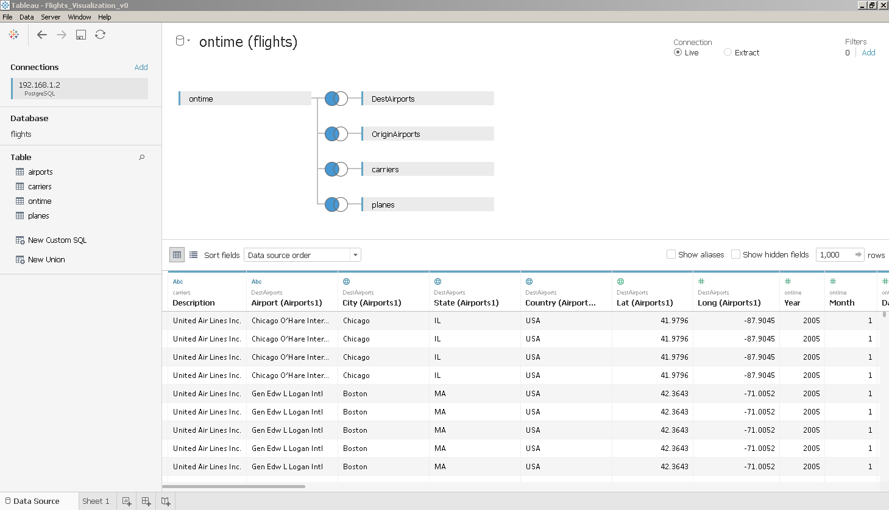

# Tableau Project

## Summary 
The data consists of flight arrival and departure details for all
commercial flights within the USA, from 2006 to 2007.  The data set which
contains information on United State flight delays and performance comes from
RITA.  The background of the data set is to measure the on-time performance of
the flights.

The objective of this story is the visualization of the determinants of flight
delays. As an introduction, I present some descriptive univariate measures for
better understanding of the data set. As an analysis, I created a number of
Tableau worksheets that show individual drivers and their impact on arrival
delays.

Data Source:  Flights data set [data source][1]

## Design

### Data Wrangling 

The data source provides a CSV files for each year of flight
movements and some additional data files for airports, planes and airlines
(carriers).  

As a first step, I uploaded the data to a PostgreSQL database, as the necessary
data wrangling is easier in SQL and the data loading in Tableau is also
faster. The database data model is documented in the file data/csv_imports.sql.  

The plane data had to be adapted: the column "year" had both missing values and "None"
values. All missing values were transformed to a database NULL value.

In the "ontime" table, which stores the flights data, some columns contained
both missing values coded as a string 'NA' and missing values with empty
fields. All missing values were transformed to a NULL value.

### Data dictionary

The data dictionary lists all columns available from the source data files. Some
of the information was copied from [BTS][3] and [FAA][4]. Not all columns are
used in the Tableau worksheets. The calculated fields are documented separately.

<table width="100%" cellpadding="0" cellspacing="0">
	<col width="12*">
	<col width="23*">
	<col width="58*">
	<col width="123*">
	<col width="40*">
	<tr>
		<th width="5%" style="border: none; padding: 0cm">
			<p><font size="3" style="font-size: 12pt">No.</font></p>
		</th>
		<th width="9%" style="border: none; padding: 0cm">
			<p align="left" style="font-variant: normal; font-style: normal"><font size="3" style="font-size: 12pt"><b>Data
			Source</b></font></p>
		</th>
		<th width="23%" style="border: none; padding: 0cm">
			<p align="left" style="font-variant: normal; font-style: normal"><font size="3" style="font-size: 12pt"><b>Column</b></font></p>
		</th>
		<th width="48%" style="border: none; padding: 0cm">
			<p align="left" style="font-variant: normal; font-style: normal"><font size="3" style="font-size: 12pt"><b>Description</b></font></p>
		</th>
		<th width="16%" style="border: none; padding: 0cm">
			<p align="left" style="font-variant: normal; font-style: normal"><font size="3" style="font-size: 12pt"><b>Field
			Type</b></font></p>
		</th>
	</tr>
	<tr>
		<td width="5%" style="border: none; padding: 0cm">
			<p>1</p>
		</td>
		<td width="9%" style="border: none; padding: 0cm">
			<p>on-time</p>
		</td>
		<td width="23%" style="border: none; padding: 0cm">
			<p>Year</p>
		</td>
		<td width="48%" style="border: none; padding: 0cm">
			<p>1987-2008</p>
		</td>
		<td width="16%" style="border: none; padding: 0cm">
			<p>Dimension</p>
		</td>
	</tr>
	<tr>
		<td width="5%" style="border: none; padding: 0cm">
			<p>2</p>
		</td>
		<td width="9%" style="border: none; padding: 0cm">
			<p>on-time</p>
		</td>
		<td width="23%" style="border: none; padding: 0cm">
			<p>Month</p>
		</td>
		<td width="48%" style="border: none; padding: 0cm">
			<p>1-12</p>
		</td>
		<td width="16%" style="border: none; padding: 0cm">
			<p>Dimension</p>
		</td>
	</tr>
	<tr>
		<td width="5%" style="border: none; padding: 0cm">
			<p>3</p>
		</td>
		<td width="9%" style="border: none; padding: 0cm">
			<p>on-time</p>
		</td>
		<td width="23%" style="border: none; padding: 0cm">
			<p>DayofMonth</p>
		</td>
		<td width="48%" style="border: none; padding: 0cm">
			<p>1-31</p>
		</td>
		<td width="16%" style="border: none; padding: 0cm">
			<p>Dimension</p>
		</td>
	</tr>
	<tr>
		<td width="5%" style="border: none; padding: 0cm">
			<p>4</p>
		</td>
		<td width="9%" style="border: none; padding: 0cm">
			<p>on-time</p>
		</td>
		<td width="23%" style="border: none; padding: 0cm">
			<p>DayOfWeek</p>
		</td>
		<td width="48%" style="border: none; padding: 0cm">
			<p>1 (Monday) - 7 (Sunday)</p>
		</td>
		<td width="16%" style="border: none; padding: 0cm">
			<p>Dimension</p>
		</td>
	</tr>
	<tr>
		<td width="5%" style="border: none; padding: 0cm">
			<p>5</p>
		</td>
		<td width="9%" style="border: none; padding: 0cm">
			<p>on-time</p>
		</td>
		<td width="23%" style="border: none; padding: 0cm">
			<p>DepTime</p>
		</td>
		<td width="48%" style="border: none; padding: 0cm">
			<p>actual departure time (local, hhmm)</p>
		</td>
		<td width="16%" style="border: none; padding: 0cm">
			<p>Dimension</p>
		</td>
	</tr>
	<tr>
		<td width="5%" style="border: none; padding: 0cm">
			<p>6</p>
		</td>
		<td width="9%" style="border: none; padding: 0cm">
			<p>on-time</p>
		</td>
		<td width="23%" style="border: none; padding: 0cm">
			<p>CRSDepTime</p>
		</td>
		<td width="48%" style="border: none; padding: 0cm">
			<p>scheduled departure time (local, hhmm) according to Computer
			Reservation System</p>
		</td>
		<td width="16%" style="border: none; padding: 0cm">
			<p>Dimension</p>
		</td>
	</tr>
	<tr>
		<td width="5%" style="border: none; padding: 0cm">
			<p>7</p>
		</td>
		<td width="9%" style="border: none; padding: 0cm">
			<p>on-time</p>
		</td>
		<td width="23%" style="border: none; padding: 0cm">
			<p>ArrTime</p>
		</td>
		<td width="48%" style="border: none; padding: 0cm">
			<p>actual (gate) arrival time (local, hhmm)</p>
		</td>
		<td width="16%" style="border: none; padding: 0cm">
			<p>Dimension</p>
		</td>
	</tr>
	<tr>
		<td width="5%" style="border: none; padding: 0cm">
			<p>8</p>
		</td>
		<td width="9%" style="border: none; padding: 0cm">
			<p>on-time</p>
		</td>
		<td width="23%" style="border: none; padding: 0cm">
			<p>CRSArrTime</p>
		</td>
		<td width="48%" style="border: none; padding: 0cm">
			<p>scheduled arrival time (local, hhmm) according to Computer
			Reservation System 
			</p>
		</td>
		<td width="16%" style="border: none; padding: 0cm">
			<p>Dimension</p>
		</td>
	</tr>
	<tr>
		<td width="5%" style="border: none; padding: 0cm">
			<p>9</p>
		</td>
		<td width="9%" style="border: none; padding: 0cm">
			<p>on-time</p>
		</td>
		<td width="23%" style="border: none; padding: 0cm">
			<p>UniqueCarrier</p>
		</td>
		<td width="48%" style="border: none; padding: 0cm">
			<p><a href="http://stat-computing.org/dataexpo/2009/supplemental-data.html"><font color="#333333">unique
			carrier code</font></a></p>
		</td>
		<td width="16%" style="border: none; padding: 0cm">
			<p>Dimension</p>
		</td>
	</tr>
	<tr>
		<td width="5%" style="border: none; padding: 0cm">
			<p>10</p>
		</td>
		<td width="9%" style="border: none; padding: 0cm">
			<p>on-time</p>
		</td>
		<td width="23%" style="border: none; padding: 0cm">
			<p>FlightNum</p>
		</td>
		<td width="48%" style="border: none; padding: 0cm">
			<p>flight number</p>
		</td>
		<td width="16%" style="border: none; padding: 0cm">
			<p>Dimension</p>
		</td>
	</tr>
	<tr>
		<td width="5%" style="border: none; padding: 0cm">
			<p>11</p>
		</td>
		<td width="9%" style="border: none; padding: 0cm">
			<p>on-time</p>
		</td>
		<td width="23%" style="border: none; padding: 0cm">
			<p>TailNum</p>
		</td>
		<td width="48%" style="border: none; padding: 0cm">
			<p>plane tail number</p>
		</td>
		<td width="16%" style="border: none; padding: 0cm">
			<p>Dimension</p>
		</td>
	</tr>
	<tr>
		<td width="5%" style="border: none; padding: 0cm">
			<p>12</p>
		</td>
		<td width="9%" style="border: none; padding: 0cm">
			<p>on-time</p>
		</td>
		<td width="23%" style="border: none; padding: 0cm">
			<p>ActualElapsedTime</p>
		</td>
		<td width="48%" style="border: none; padding: 0cm">
			<p>Flight time in minutes</p>
			<p>= ArrTime – DepTime</p>
			<p>= Taxi In + Taxi out + Airtime operations 
			</p>
		</td>
		<td width="16%" style="border: none; padding: 0cm">
			<p>Metric</p>
		</td>
	</tr>
	<tr>
		<td width="5%" style="border: none; padding: 0cm">
			<p>13</p>
		</td>
		<td width="9%" style="border: none; padding: 0cm">
			<p>on-time</p>
		</td>
		<td width="23%" style="border: none; padding: 0cm">
			<p>CRSElapsedTime</p>
		</td>
		<td width="48%" style="border: none; padding: 0cm">
			<p>Flight time in minutes according to Computer Reservation System
						</p>
			<p>= CRSArrTime - CRSDepTime</p>
		</td>
		<td width="16%" style="border: none; padding: 0cm">
			<p>Metric</p>
		</td>
	</tr>
	<tr>
		<td width="5%" style="border: none; padding: 0cm">
			<p>14</p>
		</td>
		<td width="9%" style="border: none; padding: 0cm">
			<p>on-time</p>
		</td>
		<td width="23%" style="border: none; padding: 0cm">
			<p>AirTime</p>
		</td>
		<td width="48%" style="border: none; padding: 0cm">
			<p>Flight time in minutes</p>
		</td>
		<td width="16%" style="border: none; padding: 0cm">
			<p>Metric</p>
		</td>
	</tr>
	<tr>
		<td width="5%" style="border: none; padding: 0cm">
			<p>15</p>
		</td>
		<td width="9%" style="border: none; padding: 0cm">
			<p>on-time</p>
		</td>
		<td width="23%" style="border: none; padding: 0cm">
			<p>ArrDelay</p>
		</td>
		<td width="48%" style="border: none; padding: 0cm">
			<p>arrival delay, in minutes</p>
			<p>= CRSArrTime - ArrTime</p>
		</td>
		<td width="16%" style="border: none; padding: 0cm">
			<p>Metric</p>
		</td>
	</tr>
	<tr>
		<td width="5%" style="border: none; padding: 0cm">
			<p>16</p>
		</td>
		<td width="9%" style="border: none; padding: 0cm">
			<p>on-time</p>
		</td>
		<td width="23%" style="border: none; padding: 0cm">
			<p>DepDelay</p>
		</td>
		<td width="48%" style="border: none; padding: 0cm">
			<p>departure delay, in minutes</p>
		</td>
		<td width="16%" style="border: none; padding: 0cm">
			<p>Metric</p>
		</td>
	</tr>
	<tr>
		<td width="5%" style="border: none; padding: 0cm">
			<p>17</p>
		</td>
		<td width="9%" style="border: none; padding: 0cm">
			<p>on-time</p>
		</td>
		<td width="23%" style="border: none; padding: 0cm">
			<p>Origin</p>
		</td>
		<td width="48%" style="border: none; padding: 0cm">
			<p>origin&nbsp;<a href="http://stat-computing.org/dataexpo/2009/supplemental-data.html"><font color="#333333">IATA
			airport code</font></a></p>
		</td>
		<td width="16%" style="border: none; padding: 0cm">
			<p>Dimension</p>
		</td>
	</tr>
	<tr>
		<td width="5%" style="border: none; padding: 0cm">
			<p>18</p>
		</td>
		<td width="9%" style="border: none; padding: 0cm">
			<p>on-time</p>
		</td>
		<td width="23%" style="border: none; padding: 0cm">
			<p>Dest</p>
		</td>
		<td width="48%" style="border: none; padding: 0cm">
			<p>destination&nbsp;<a href="http://stat-computing.org/dataexpo/2009/supplemental-data.html"><font color="#333333">IATA
			airport code</font></a></p>
		</td>
		<td width="16%" style="border: none; padding: 0cm">
			<p>Dimension</p>
		</td>
	</tr>
	<tr>
		<td width="5%" style="border: none; padding: 0cm">
			<p>19</p>
		</td>
		<td width="9%" style="border: none; padding: 0cm">
			<p>on-time</p>
		</td>
		<td width="23%" style="border: none; padding: 0cm">
			<p>Distance</p>
		</td>
		<td width="48%" style="border: none; padding: 0cm">
			<p>in miles</p>
		</td>
		<td width="16%" style="border: none; padding: 0cm">
			<p>Metric</p>
		</td>
	</tr>
	<tr>
		<td width="5%" style="border: none; padding: 0cm">
			<p>20</p>
		</td>
		<td width="9%" style="border: none; padding: 0cm">
			<p>on-time</p>
		</td>
		<td width="23%" style="border: none; padding: 0cm">
			<p>TaxiIn</p>
		</td>
		<td width="48%" style="border: none; padding: 0cm">
			<p>taxi in time, in minutes</p>
		</td>
		<td width="16%" style="border: none; padding: 0cm">
			<p>Metric</p>
		</td>
	</tr>
	<tr>
		<td width="5%" style="border: none; padding: 0cm">
			<p>21</p>
		</td>
		<td width="9%" style="border: none; padding: 0cm">
			<p>on-time</p>
		</td>
		<td width="23%" style="border: none; padding: 0cm">
			<p>TaxiOut</p>
		</td>
		<td width="48%" style="border: none; padding: 0cm">
			<p>taxi out time in minutes</p>
		</td>
		<td width="16%" style="border: none; padding: 0cm">
			<p>Metric</p>
		</td>
	</tr>
	<tr>
		<td width="5%" style="border: none; padding: 0cm">
			<p>22</p>
		</td>
		<td width="9%" style="border: none; padding: 0cm">
			<p>on-time</p>
		</td>
		<td width="23%" style="border: none; padding: 0cm">
			<p>Cancelled</p>
		</td>
		<td width="48%" style="border: none; padding: 0cm">
			<p>was the flight cancelled?</p>
		</td>
		<td width="16%" style="border: none; padding: 0cm">
			<p>Metric</p>
		</td>
	</tr>
	<tr>
		<td width="5%" style="border: none; padding: 0cm">
			<p>23</p>
		</td>
		<td width="9%" style="border: none; padding: 0cm">
			<p>on-time</p>
		</td>
		<td width="23%" style="border: none; padding: 0cm">
			<p>CancellationCode</p>
		</td>
		<td width="48%" style="border: none; padding: 0cm">
			<p>reason for cancellation (A = carrier, B = weather, C = NAS, D =
			security). National Aviation System (NAS)</p>
		</td>
		<td width="16%" style="border: none; padding: 0cm">
			<p>Metric</p>
		</td>
	</tr>
	<tr>
		<td width="5%" style="border: none; padding: 0cm">
			<p>24</p>
		</td>
		<td width="9%" style="border: none; padding: 0cm">
			<p>on-time</p>
		</td>
		<td width="23%" style="border: none; padding: 0cm">
			<p>Diverted</p>
		</td>
		<td width="48%" style="border: none; padding: 0cm">
			<p>1 = yes, 0 = no</p>
		</td>
		<td width="16%" style="border: none; padding: 0cm">
			<p>Metric</p>
		</td>
	</tr>
	<tr>
		<td width="5%" style="border: none; padding: 0cm">
			<p>25</p>
		</td>
		<td width="9%" style="border: none; padding: 0cm">
			<p>on-time</p>
		</td>
		<td width="23%" style="border: none; padding: 0cm">
			<p>CarrierDelay</p>
		</td>
		<td width="48%" style="border: none; padding: 0cm">
			<p>in minutes</p>
		</td>
		<td width="16%" style="border: none; padding: 0cm">
			<p>Metric</p>
		</td>
	</tr>
	<tr>
		<td width="5%" style="border: none; padding: 0cm">
			<p>26</p>
		</td>
		<td width="9%" style="border: none; padding: 0cm">
			<p>on-time</p>
		</td>
		<td width="23%" style="border: none; padding: 0cm">
			<p>WeatherDelay</p>
		</td>
		<td width="48%" style="border: none; padding: 0cm">
			<p>in minutes</p>
		</td>
		<td width="16%" style="border: none; padding: 0cm">
			<p>Metric</p>
		</td>
	</tr>
	<tr>
		<td width="5%" style="border: none; padding: 0cm">
			<p>27</p>
		</td>
		<td width="9%" style="border: none; padding: 0cm">
			<p>on-time</p>
		</td>
		<td width="23%" style="border: none; padding: 0cm">
			<p>NASDelay</p>
		</td>
		<td width="48%" style="border: none; padding: 0cm">
			<p>in minutes</p>
		</td>
		<td width="16%" style="border: none; padding: 0cm">
			<p>Metric</p>
		</td>
	</tr>
	<tr>
		<td width="5%" style="border: none; padding: 0cm">
			<p>28</p>
		</td>
		<td width="9%" style="border: none; padding: 0cm">
			<p>on-time</p>
		</td>
		<td width="23%" style="border: none; padding: 0cm">
			<p>SecurityDelay</p>
		</td>
		<td width="48%" style="border: none; padding: 0cm">
			<p>in minutes</p>
		</td>
		<td width="16%" style="border: none; padding: 0cm">
			<p>Metric</p>
		</td>
	</tr>
	<tr>
		<td width="5%" style="border: none; padding: 0cm">
			<p>29</p>
		</td>
		<td width="9%" style="border: none; padding: 0cm">
			<p>on-time</p>
		</td>
		<td width="23%" style="border: none; padding: 0cm">
			<p>LateAircraftDelay</p>
		</td>
		<td width="48%" style="border: none; padding: 0cm">
			<p>in minutes</p>
		</td>
		<td width="16%" style="border: none; padding: 0cm">
			<p>Metric</p>
		</td>
	</tr>
	<tr>
		<td width="5%" style="border: none; padding: 0cm">
			<p>30</p>
		</td>
		<td width="9%" style="border: none; padding: 0cm">
			<p>airports</p>
		</td>
		<td width="23%" style="border: none; padding: 0cm">
			<p>IATA</p>
		</td>
		<td width="48%" style="border: none; padding: 0cm">
			<p>Airport code</p>
		</td>
		<td width="16%" style="border: none; padding: 0cm">
			<p>Dimension</p>
		</td>
	</tr>
	<tr>
		<td width="5%" style="border: none; padding: 0cm">
			<p>31</p>
		</td>
		<td width="9%" style="border: none; padding: 0cm">
			<p>airports</p>
		</td>
		<td width="23%" style="border: none; padding: 0cm">
			<p>Airport</p>
		</td>
		<td width="48%" style="border: none; padding: 0cm">
			<p>Name</p>
		</td>
		<td width="16%" style="border: none; padding: 0cm">
			<p>Dimension</p>
		</td>
	</tr>
	<tr>
		<td width="5%" style="border: none; padding: 0cm">
			<p>32</p>
		</td>
		<td width="9%" style="border: none; padding: 0cm">
			<p>airports</p>
		</td>
		<td width="23%" style="border: none; padding: 0cm">
			<p>City</p>
		</td>
		<td width="48%" style="border: none; padding: 0cm">
			<p><br/>

			</p>
		</td>
		<td width="16%" style="border: none; padding: 0cm">
			<p>Dimension</p>
		</td>
	</tr>
	<tr>
		<td width="5%" style="border: none; padding: 0cm">
			<p>33</p>
		</td>
		<td width="9%" style="border: none; padding: 0cm">
			<p>airports</p>
		</td>
		<td width="23%" style="border: none; padding: 0cm">
			<p>State</p>
		</td>
		<td width="48%" style="border: none; padding: 0cm">
			<p><br/>

			</p>
		</td>
		<td width="16%" style="border: none; padding: 0cm">
			<p>Dimension</p>
		</td>
	</tr>
	<tr>
		<td width="5%" style="border: none; padding: 0cm">
			<p>34</p>
		</td>
		<td width="9%" style="border: none; padding: 0cm">
			<p>airports</p>
		</td>
		<td width="23%" style="border: none; padding: 0cm">
			<p>Country</p>
		</td>
		<td width="48%" style="border: none; padding: 0cm">
			<p><br/>

			</p>
		</td>
		<td width="16%" style="border: none; padding: 0cm">
			<p>Dimension</p>
		</td>
	</tr>
	<tr>
		<td width="5%" style="border: none; padding: 0cm">
			<p>35</p>
		</td>
		<td width="9%" style="border: none; padding: 0cm">
			<p>airports</p>
		</td>
		<td width="23%" style="border: none; padding: 0cm">
			<p>lat</p>
		</td>
		<td width="48%" style="border: none; padding: 0cm">
			<p>Latitude</p>
		</td>
		<td width="16%" style="border: none; padding: 0cm">
			<p>Dimension</p>
		</td>
	</tr>
	<tr>
		<td width="5%" style="border: none; padding: 0cm">
			<p>36</p>
		</td>
		<td width="9%" style="border: none; padding: 0cm">
			<p>airports</p>
		</td>
		<td width="23%" style="border: none; padding: 0cm">
			<p>long</p>
		</td>
		<td width="48%" style="border: none; padding: 0cm">
			<p>Longitude</p>
		</td>
		<td width="16%" style="border: none; padding: 0cm">
			<p>Dimension</p>
		</td>
	</tr>
	<tr>
		<td width="5%" style="border: none; padding: 0cm">
			<p>37</p>
		</td>
		<td width="9%" style="border: none; padding: 0cm">
			<p>carriers</p>
		</td>
		<td width="23%" style="border: none; padding: 0cm">
			<p>Code</p>
		</td>
		<td width="48%" style="border: none; padding: 0cm">
			<p><br/>

			</p>
		</td>
		<td width="16%" style="border: none; padding: 0cm">
			<p>Dimension</p>
		</td>
	</tr>
	<tr>
		<td width="5%" style="border: none; padding: 0cm">
			<p>38</p>
		</td>
		<td width="9%" style="border: none; padding: 0cm">
			<p>carriers</p>
		</td>
		<td width="23%" style="border: none; padding: 0cm">
			<p>Description</p>
		</td>
		<td width="48%" style="border: none; padding: 0cm">
			<p><br/>

			</p>
		</td>
		<td width="16%" style="border: none; padding: 0cm">
			<p>Dimension</p>
		</td>
	</tr>
	<tr>
		<td width="5%" style="border: none; padding: 0cm">
			<p>39</p>
		</td>
		<td width="9%" style="border: none; padding: 0cm">
			<p>planes</p>
		</td>
		<td width="23%" style="border: none; padding: 0cm">
			<p>tailnum</p>
		</td>
		<td width="48%" style="border: none; padding: 0cm">
			<p><br/>

			</p>
		</td>
		<td width="16%" style="border: none; padding: 0cm">
			<p>Dimension</p>
		</td>
	</tr>
	<tr>
		<td width="5%" style="border: none; padding: 0cm">
			<p>40</p>
		</td>
		<td width="9%" style="border: none; padding: 0cm">
			<p>planes</p>
		</td>
		<td width="23%" style="border: none; padding: 0cm">
			<p>type</p>
		</td>
		<td width="48%" style="border: none; padding: 0cm">
			<p><br/>

			</p>
		</td>
		<td width="16%" style="border: none; padding: 0cm">
			<p>Dimension</p>
		</td>
	</tr>
	<tr>
		<td width="5%" style="border: none; padding: 0cm">
			<p>41</p>
		</td>
		<td width="9%" style="border: none; padding: 0cm">
			<p>planes</p>
		</td>
		<td width="23%" style="border: none; padding: 0cm">
			<p>manufacturer</p>
		</td>
		<td width="48%" style="border: none; padding: 0cm">
			<p><br/>

			</p>
		</td>
		<td width="16%" style="border: none; padding: 0cm">
			<p>Dimension</p>
		</td>
	</tr>
	<tr>
		<td width="5%" style="border: none; padding: 0cm">
			<p>42</p>
		</td>
		<td width="9%" style="border: none; padding: 0cm">
			<p>planes</p>
		</td>
		<td width="23%" style="border: none; padding: 0cm">
			<p>issue_date</p>
		</td>
		<td width="48%" style="border: none; padding: 0cm">
			<p>Certificate issue date</p>
		</td>
		<td width="16%" style="border: none; padding: 0cm">
			<p>Dimension</p>
		</td>
	</tr>
	<tr>
		<td width="5%" style="border: none; padding: 0cm">
			<p>43</p>
		</td>
		<td width="9%" style="border: none; padding: 0cm">
			<p>planes</p>
		</td>
		<td width="23%" style="border: none; padding: 0cm">
			<p>model</p>
		</td>
		<td width="48%" style="border: none; padding: 0cm">
			<p><br/>

			</p>
		</td>
		<td width="16%" style="border: none; padding: 0cm">
			<p>Dimension</p>
		</td>
	</tr>
	<tr>
		<td width="5%" style="border: none; padding: 0cm">
			<p>44</p>
		</td>
		<td width="9%" style="border: none; padding: 0cm">
			<p>planes</p>
		</td>
		<td width="23%" style="border: none; padding: 0cm">
			<p>status</p>
		</td>
		<td width="48%" style="border: none; padding: 0cm">
			<p><br/>

			</p>
		</td>
		<td width="16%" style="border: none; padding: 0cm">
			<p>Dimension</p>
		</td>
	</tr>
	<tr>
		<td width="5%" style="border: none; padding: 0cm">
			<p>45</p>
		</td>
		<td width="9%" style="border: none; padding: 0cm">
			<p>planes</p>
		</td>
		<td width="23%" style="border: none; padding: 0cm">
			<p>aircraft_type</p>
		</td>
		<td width="48%" style="border: none; padding: 0cm">
			<p><br/>

			</p>
		</td>
		<td width="16%" style="border: none; padding: 0cm">
			<p>Dimension</p>
		</td>
	</tr>
	<tr>
		<td width="5%" style="border: none; padding: 0cm">
			<p>46</p>
		</td>
		<td width="9%" style="border: none; padding: 0cm">
			<p>planes</p>
		</td>
		<td width="23%" style="border: none; padding: 0cm">
			<p>engine_type</p>
		</td>
		<td width="48%" style="border: none; padding: 0cm">
			<p><br/>

			</p>
		</td>
		<td width="16%" style="border: none; padding: 0cm">
			<p>Dimension</p>
		</td>
	</tr>
	<tr>
		<td width="5%" style="border: none; padding: 0cm">
			<p>47</p>
		</td>
		<td width="9%" style="border: none; padding: 0cm">
			<p>planes</p>
		</td>
		<td width="23%" style="border: none; padding: 0cm">
			<p>year</p>
		</td>
		<td width="48%" style="border: none; padding: 0cm">
			<p>Year manufactured</p>
		</td>
		<td width="16%" style="border: none; padding: 0cm">
			<p>Dimension</p>
		</td>
	</tr>
	<tr>
		<td width="5%" style="border: none; padding: 0cm">
			<p><br/>

			</p>
		</td>
		<td width="9%" style="border: none; padding: 0cm">
			<p><br/>

			</p>
		</td>
		<td width="23%" style="border: none; padding: 0cm">
			<p><br/>

			</p>
		</td>
		<td width="48%" style="border: none; padding: 0cm">
			<p><br/>

			</p>
		</td>
		<td width="16%" style="border: none; padding: 0cm">
			<p><br/>

			</p>
		</td>
	</tr>
</table>


#### Calculated fields in Tableau: 

```
delayed-flag := 
IF [Diverted]="0" AND [Cancelled]=0 THEN 
	IIF([Arrdelay]>=15, TRUE, FALSE) 
ELSE 
	FALSE 
END
```

The delayed-flag calculation follows the [BTS reporting definitions][2]. Causal
data is reported for cancelled and late arriving flights (flights that arrive at
the destination airport 15 minutes or more after the scheduled arrival time). No
causal data are required for flights that are considered on-time or for diverted
flights.

```
DelayedFlightRatio := sum([DelayedFlag])/sum([No. of Flights])
``` 

The DelayedFlightRatio calculates the share of delayed flights.

The field "Number of Records" was renamed to "No. of Flights", as each data
record corresponds to one flight. 


#### Calculated field in SQL 

```SQL 
FlightDate :=
make_date(Year,Month,Dayofmonth) 
``` 

For performance reasons, the Tableau workbook relies on extracts. As the Tableau
function for Date conversion is only available for extracts, but not for SQL
data sources, I had to do the Date conversion in PostgreSQL. I removed columns
not used in the visualizations from the data extract.


### Tableau Data Model:



All joins are left outer joins, so that the additional data sources airports,
carriers and planes only add to the ontime data set.

Each line in the data set represents one commercial flight. I included the years
2006 - 2007 in the dataset. Tableau Public only accepts workbooks with at most
15 million data records; as each year has about 7 million flights, I was limited
to two years of data. The background of the data set is to measure the on-time
performance of the flights.

### First design

#### Research objectives
The objective of the exploratory data analysis in Tableau consisted of finding
answers to the following main research question: what are the determinants of delay? This
question was split up into the following parts: 

- What is the structure of the flights network? How much delay is on each flight path
   on average?
- When is the best time of day/day of week/time of year to fly to minimize
  delays?
- Do older planes suffer more delays?
- How much of the delay can be attributed to the weather?
- What airports are delayed the most?
- What airlines are delayed the most on average?


#### Design decisions

The whole data analysis is organized as one Tableau story, in which each slide is a
Tableau dashboard. This give me the most layout choices and the additional
functionality of dashboards. Each dashboard is either a single worksheet or a
combination of worksheets. 

*Slide 1: Introduction* 

The introduction slide briefly describes the data set and explains the purpose
of the Tableau story. I inserted a picture of a plane as a visual cue.

*Slide 2: Univariate Analysis*

In this slide, I would like to show how busy different airports and carriers
are. I counted the number of arriving flights per airport and the total number
of flights per airline. I used a separate horizontal bar chart for each count,
as the length of the bar gives a good impression of the magnitude of the
value. As all airports would not fit on one slide, I filtered for the top 20
airports, but I added a filter list at the right side of the dashboard, so that
the user can still select airports of interest. All bars have tooltips with
individual values.

*Slide 3: Arrival Delay per Carrier*

Throughout my analysis, I focus on the arrival delay, as I think that this
metric should be the most relevant from a passenger perspective. As a flyer, I
need to know whether I reach my destination on time. So this text table is
supposed to give the reader an impression of the statistical distribution of the
arrival delay per airline. Just giving averages is not enough for the highly
skewed arrival data.  At first, I tried to use a box plot, which relies on
individual data points (disaggregated data). But when the measures are not
aggregated by Tableau, at least my local Tableau client cannot cope with the
data volume. So I decided to go with a table including mean and quantiles.
Values indicating a delay are printed in red; values indicating an early arrival
are printed in green, with a red-green diverging color scheme, which emphasizes
extreme values. A corresponding legend is shown on the right. Each table cell
has a tooltip with its individual value.

*Slide 4: Arrival Delay per Airport*

In this chart, I would like to compare the median arrival delay per airport with
the number of delayed flights per airport - only showing the median delay is not
very informative. I chose a horizontal bar chart for the median arrival delay
and added crosses for the number of delayed flights with a second
axis. I chose this layout as it helps to distinguish the delay measure from the
flight number measure. 
Bars indicating a delay are drawn in red; bars indicating an early arrival
are drawn in green, with a red-green diverging color scheme, which emphasizes
extreme values. A corresponding legend is shown on the right.
I limited the number of displayed airports for better readability and added a
filter for individual customization of the chart.
All bars and crosses have tooltips with individual values.

*Slide 5: Delay on the most frequented flight paths*

In this chart, I would like to show the median arrival delay on the busiest
flight paths. I chose a horizontal bar chart for the median arrival delay.
Bars indicating a delay are drawn in red; bars indicating an early arrival are
drawn in green, with a red-green diverging color scheme, which emphasizes
extreme values. A corresponding legend is shown on the right. I limited the
number of displayed paths to the top 20% for better readability; this value can
be tuned with the filter for number of flights on the right. I also added a
filter for both the origin and destination airport for individual customization
of the chart.  All bars have tooltips with individual values.

*Slide 6: Cause of Delay per Airport*

In this slide, I would like to show the cause of delay per airport; however, to
make the slide more meaningful, I chose the top 3 international airports, that
either have a high or low arrival delay (see slide 4). For each of the airports,
I used a stacked bar chart to show the proportion of different causes of delay,
normalized to 100%. A tooltip shows the exact value of each bar. I used the
default Tableau color palette with categorical colors, so that each measure clearly
stands out. A legend on the right side explains the meaning of each color.  
I placed the two horizontal bar charts on top of each other, so that the reader
can directly compare the proportion of causes of the different airports.

*Slide 7: Delay per Week of the Year*

This chart is supposed to show the seasonal causes of delay. A line chart
displays the average arrival delay per week per airline (as an average of the
flights in this week in 2006 and 2007). Each airline has its own color (from a
categorical color scale). The color coding is explained in a legend on the right
side. Currently, only the 6 largest airlines are selected, as more lines make
the chart hard to read. However, the user can select the desired airlines using
a filter in the dashboard.

*Slide 8: Delay per Plane Age*

The scatter plot compares the ratio of delayed flights per plane with the year
in which this plane was manufactured. A red linear regression line shows the
effect. All lines and dots are supported by tooltips. The user can experiment
whether the effect disappears after filtering for younger planes; a
corresponding filter is part of the dashboard.

Here is the URL to the [published first version on Tableau Public](https://public.tableau.com/profile/j.rg.strebel#!/vizhome/Flights_Visualization_v2/StoryFlights?publish=yes)


### Changes after feedback

*Slide 4: Arrival Delay per Airport*

My interpretation of the feedback of both reviewers: the original chart is a bit
overloaded with the bars and the crosses, so users are puzzled at first. One
reviewer had the suggestion to use stacked bars instead of X shapes (crosses). I
did not follow this idea, as the two measures have vastly different scales. 

I made the following layout changes to the original chart: I put two horizontal
bar charts side by side, one for each measure (median arrival delay and number
of delayed flights). This creates a cleaner layout; no more crosses are drawn on
top of text or other bars, and the user can still see both measures for one
airport on the same line.  The second measure (number of delayed flights) uses a
sequential scale to draw the bars, and uses the color hue to emphasize the
magnitude of the measure. An associated legend is visible on the right, and the
tooltip includes the second measure.

*Slide 5: Delay on the most frequented flight paths*

In this slide, I needed a scroll bar to maintain chart readability when the
number of flights filter is changed to lower values, i.e. more entries in the
bar chart. Tableau automatically shows a scroll bar, when the fit setting of the
dashboard chart container is set to "Fit Width".

One reviewer had the impression that a near-zero median arrival delay could be
caused by a lack of data for this flight path. I decided to show additional data
to reduce that impression. I added another measure in the chart, number of
delayed flights.  The horizontal bars have a color hue depending on the
magnitude of the value; the color scale is sequential to show the continuous
nature of the measure. An associated legend has been added, and the tooltip
includes the new measure.
Now, it should be clearer that each median arrival delay is based on a large
number of delayed flights.

Here is the URL to the [published updated version on Tableau Public](https://public.tableau.com/profile/j.rg.strebel#!/vizhome/Flights_Visualization_v3/StoryFlights?publish=yes)

## Feedback 

I received two feedback messages after publishing my first version on Tableau Public:

- [Udacity Discussion Forum](https://discussions.udacity.com/t/feedback-wanted-on-my-tableau-visualization-flights-data/663378)
- [Email message from a BMW colleague in German](./AW%20Feedback%20wanted%20for%20Udacity%20Tableau%20project.htm). 

Translation of the German email: 

> Hallo Jörg,
> looks already pretty cool.
> I have two spontaneous remarks:
> 
> 
> **Comparison of median delay per airport and the number of delayed flights at this airport sorted by number of delayed flights (slide 4)**
> I found this one relatively hard to parse and to understand and I am still
> contemplating what the core messages of the chart is supposed to be.
> In the legend, the orange box is probably the same as the orange crosses in the
> chart, but I was shortly puzzled.
>
>
> ** Slide 5**
> Here, Los Angeles International seem to have median delay 0 - at first sight,
> it looks almost like as if there was no data available for this airport.
> If you change the number of flights, you can render the chart pretty hard to
> read - that's probably a Tableau issue.

> Regards
> Jan


## Resources
[1]: http://stat-computing.org/dataexpo/2009/the-data.html Flights data and data dictionary.
[2]: https://www.bts.gov/topics/airlines-and-airports/number-14-time-reporting Definitions of Bureau of Transportation Statistics
[3]: https://www.transtats.bts.gov/Fields.asp?Table_ID=236 Column descriptions
[4]: https://www.faa.gov/licenses_certificates/aircraft_certification/aircraft_registry/media/ardata.pdf Description of plane attributes.


I hereby confirm that this submission is my work.  I have cited above the
origins of any parts of the submission that were taken from Websites, books,
forums, blog posts, github repositories, etc.
